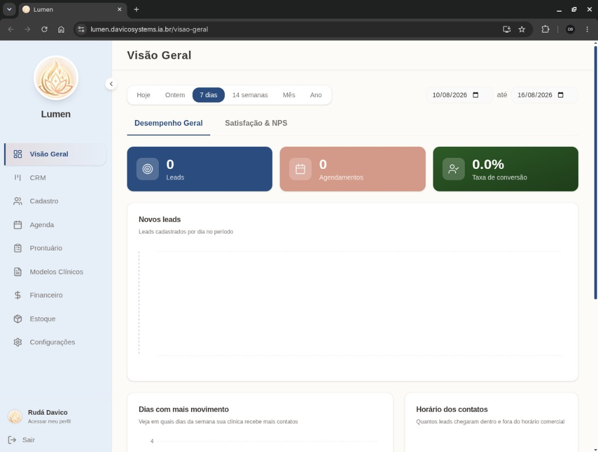
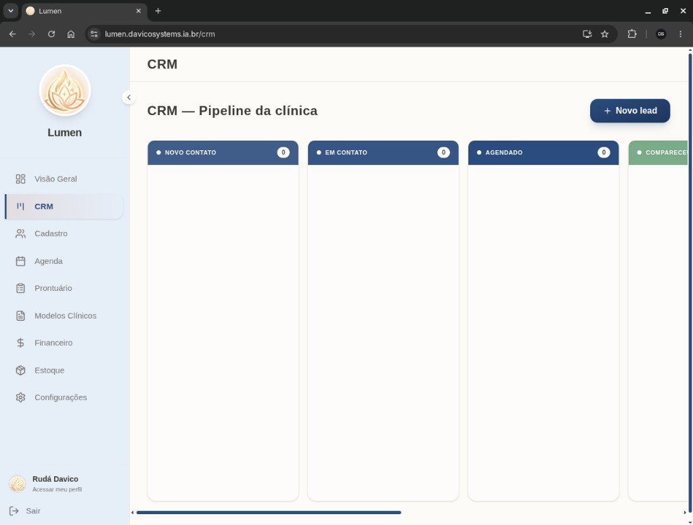
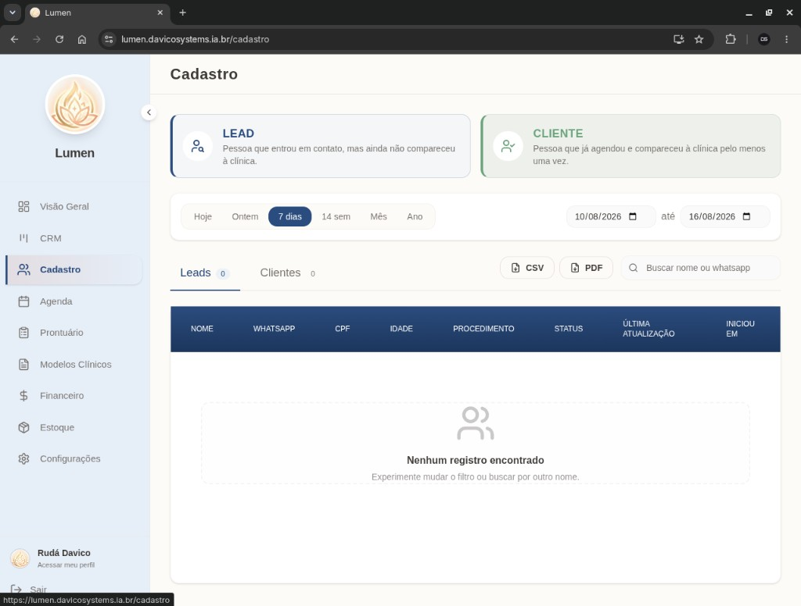
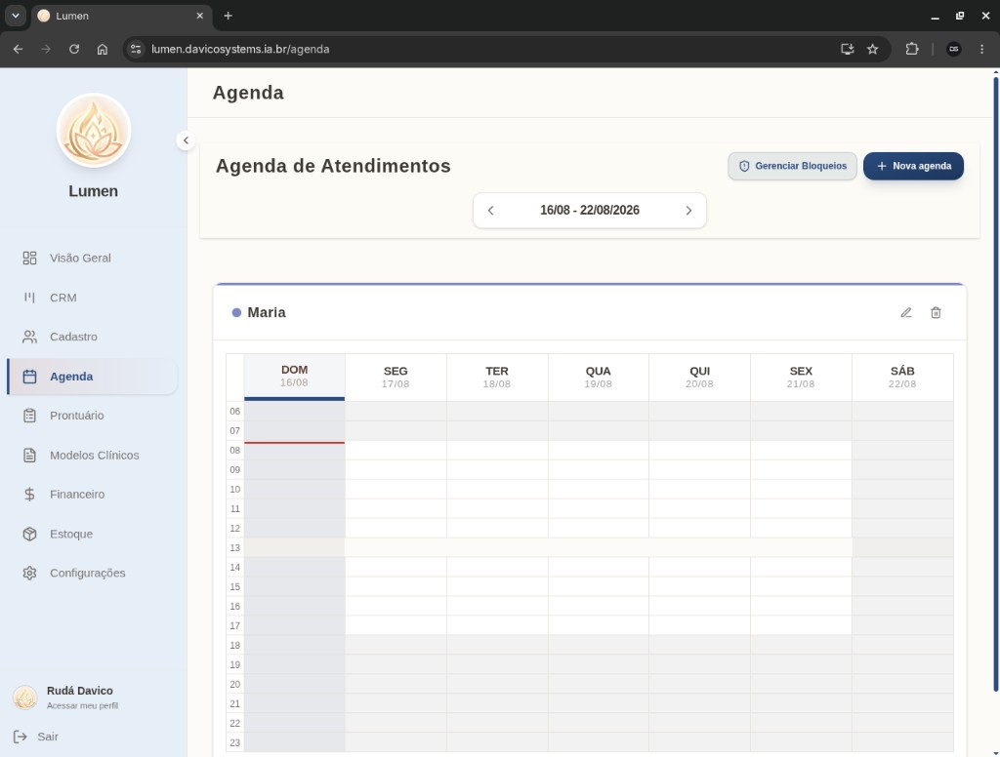
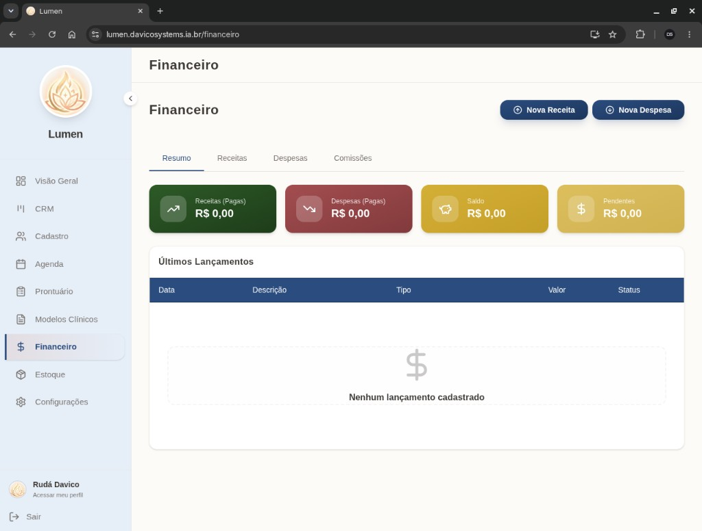
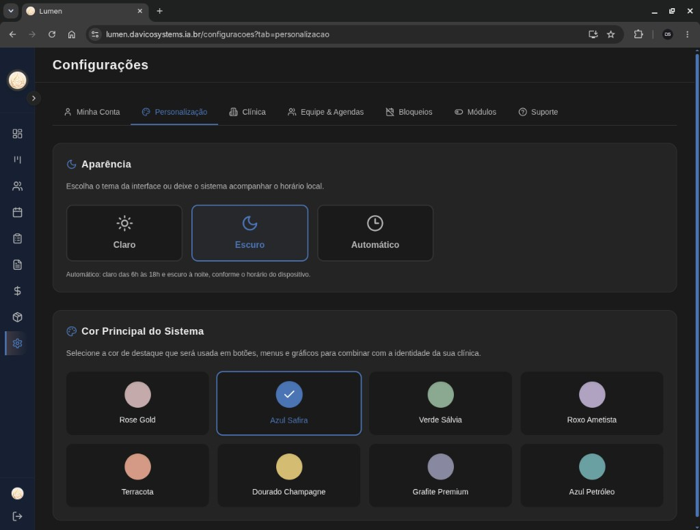
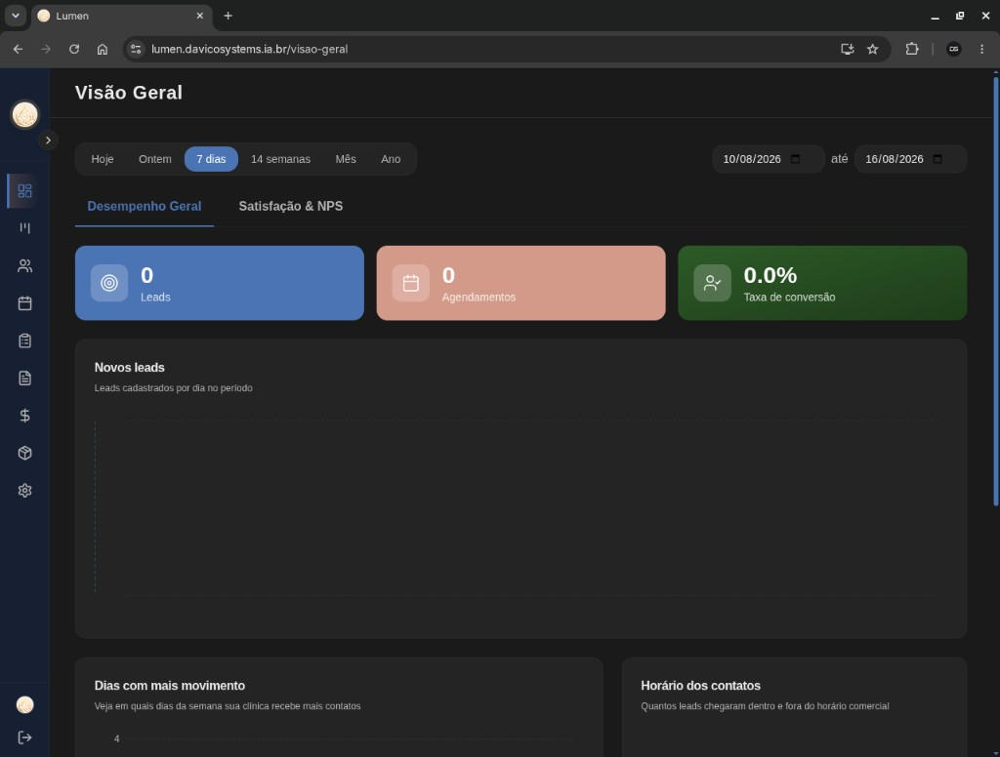
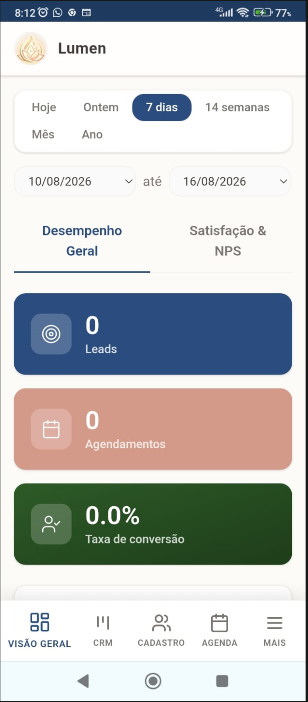
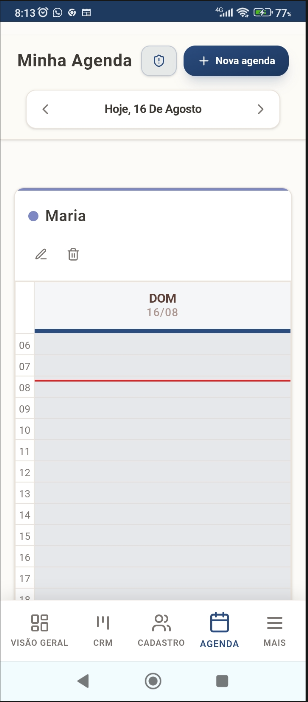
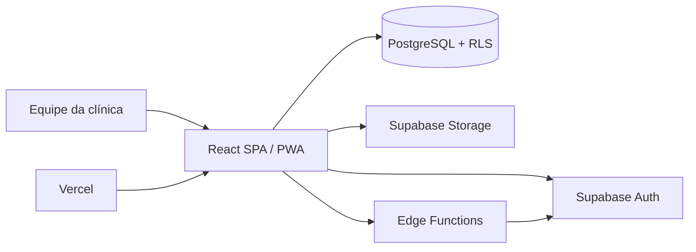

# Lumen

Sistema web white-label para centralizar a operação de clínicas de estética e
saúde. O produto reúne atendimento, gestão clínica e administração em uma
interface responsiva, substituindo planilhas e ferramentas isoladas.

**Aplicação em produção:** [lumen.davicosystems.ia.br](https://lumen.davicosystems.ia.br)

## Interface

Capturas do ambiente de demonstração em produção.

### Dashboard — indicadores do período



### CRM — pipeline de leads em Kanban



### Cadastro — leads e clientes



### Agenda — grade semanal multiprofissional



### Financeiro — receitas, despesas e saldo



### Personalização — tema e identidade visual





### Mobile — PWA responsiva

| Dashboard | Agenda |
| --- | --- |
|  |  |

## Problema que o projeto resolve

Clínicas pequenas e médias costumam manter agenda, contatos comerciais,
prontuários, estoque e financeiro em sistemas diferentes. Isso fragmenta os
dados e dificulta acompanhar a jornada do paciente.

O Lumen oferece um fluxo único:

1. o contato entra no CRM e avança pelo funil;
2. a equipe cadastra o paciente e agenda o atendimento;
3. o especialista registra prontuário e evolução clínica;
4. a gestão acompanha indicadores, estoque e movimentações financeiras.

## Principais funcionalidades

- **Dashboard:** indicadores operacionais, confirmações, NPS e visão do período.
- **CRM em Kanban:** gestão visual de leads e etapas do atendimento.
- **Cadastro de pacientes:** dados pessoais e histórico centralizados.
- **Agenda multiprofissional:** agendas independentes, bloqueios e vínculo de
  especialistas.
- **Prontuário eletrônico:** fichas, anamneses, evoluções, documentos e
  assinaturas.
- **Modelos clínicos:** formulários reutilizáveis para padronizar atendimentos.
- **Financeiro e estoque:** módulos que podem ser ativados conforme o plano.
- **Gestão de acessos:** perfis de superadministrador, dono, gestor e
  especialista, com permissões distintas.
- **Personalização white-label:** nome, logo, cores, tema e módulos por clínica.
- **PWA responsiva:** uso no desktop ou instalação em dispositivos móveis.

## Arquitetura



- O frontend é uma SPA publicada na Vercel.
- O Supabase fornece autenticação, PostgreSQL, armazenamento de arquivos e
  funções server-side.
- Políticas de Row Level Security protegem os dados e as operações por perfil.
- Edge Functions executam ações administrativas sensíveis, como criar e
  remover contas, sem expor a service role no navegador.
- Cada clínica recebe uma instância isolada do sistema e do banco, facilitando
  personalização, segurança e manutenção.

## Decisões técnicas

- **RBAC:** as rotas, ações da interface e políticas do banco consideram o
  papel do usuário.
- **Módulos configuráveis:** prontuário, financeiro e estoque podem ser
  habilitados sem manter versões diferentes do frontend.
- **White-label automatizado:** scripts geram o pacote e o checklist de uma
  nova clínica.
- **Operação self-contained:** a versão atual funciona apenas com
  Vercel + Supabase, sem depender de n8n para as rotinas principais.
- **Administração segura:** criação e exclusão de usuários ocorrem no servidor;
  a pessoa recebe uma senha temporária e pode alterá-la após entrar.

## Tecnologias

- React 19, TypeScript e React Router
- Vite 6, Tailwind CSS 4 e PWA
- Supabase Auth, PostgreSQL, RLS, Storage e Edge Functions
- FullCalendar, Recharts, jsPDF e drag-and-drop
- Vercel para build e deploy contínuo

## Executar localmente

Requisitos: Node.js 20+ e um projeto Supabase configurado.

```bash
git clone https://github.com/davicoruda-coder/lumen.git
cd lumen
npm install
cp .env.example .env
npm run dev
```

Preencha no `.env`:

```env
VITE_SUPABASE_URL=https://SEU_PROJETO.supabase.co
VITE_SUPABASE_ANON_KEY=SUA_CHAVE_ANON
VITE_SUPPORT_WHATSAPP_NUMBER=55DDDNUMERO
```

Comandos úteis:

```bash
npm run build
npm run lint
npm run validar-clonagem
npm run clonar-clinica
```

## Implantar para uma nova clínica

O comando de clonagem solicita os dados da clínica e gera arquivos de
configuração, scripts SQL e um checklist em `clientes/<slug>/`.

```bash
npm run validar-clonagem
npm run clonar-clinica
```

Consulte o [guia de clonagem](documentacao/CLONAGEM_CLINICA.md) e o
[playbook técnico](documentacao/playbook_tecnico_clonagem.md).

## Escopo atual

A aplicação concentra a gestão dentro do próprio painel. Integrações com
WhatsApp, IA e sincronização com Google Calendar estão no
[roadmap do produto](documentacao/VISAO_PRODUTO.md), não na versão atual.

Este projeto evoluiu a partir do
[sistema-clinica01](https://github.com/davicoruda-coder/sistema-clinica01),
separando o produto operacional das automações externas.

## Licença

Projeto proprietário — DavicoSystems.
